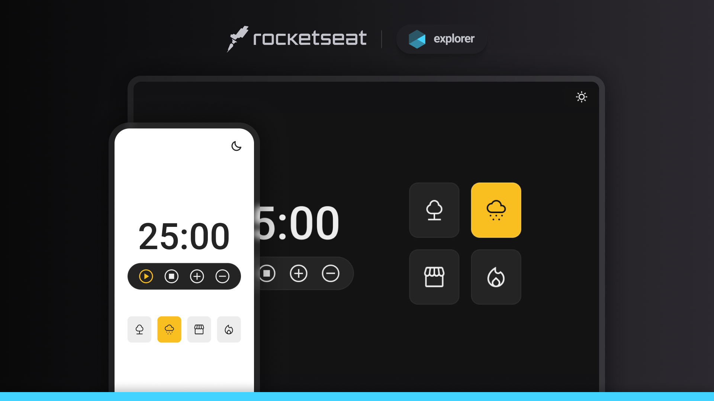

# RKT.EXP-18.Challenge-Focus-Timer
<!-- title page -->
<h1 align="center"> Challenge Focus Timer </h1>

<!-- header tags -->

  <!-- Rocketseat -->
  
  <!-- / -->
  
  <!-- Explorer -->
  
  <!-- / -->
  
  <!-- Nível 6 -->
  
  <!-- / -->
  
  <!-- Nível 04: Avançando no JavaScript -->
  
  <!-- / -->
  
  <!-- Challenge Focus Timer -->
  

<!-- nav -->

  <a href="#-tecnologias">Tecnologias</a>&nbsp;&nbsp;&nbsp;|&nbsp;&nbsp;&nbsp;
  <a href="#-projeto">Projeto</a>&nbsp;&nbsp;&nbsp;|&nbsp;&nbsp;&nbsp;
  <a href="#-layout">Layout</a>

<!-- cover -->

  

## 🚀 Tecnologias
Esse projeto foi desenvolvido com as seguintes tecnologias:

- HTML5 e CSS3
- JavaScript ES6
- Git e Github

## 💻 Projeto
O projeto <strong>Focus Timer 2.0</strong> é uma aplicação de cronômetro regressivo que permite ao usuário iniciar sessões de foco acompanhadas de sons ambientes, além de recursos de controle de volume, alternância de tema (claro/escuro) e timer configurável. É o 18º projeto desenvolvido durante a formação Explorer da Rocketseat. 

Este projeto foi desenvolvido com tecnologias <strong>HTML</strong>, <strong>CSS</strong> e <strong>JavaScript</strong>, prezando pelas boas práticas de acessibilidade, semântica e arquitetura de código.

O <strong>JavaScript</strong> foi modularizado com responsabilidades bem definidas para cada arquivo, incluindo controle do DOM, manipulação do tempo, estados dos botões, e integração com os elementos de interface. Recursos como <code>setTimeout</code>, manipulação de eventos, objetos e funções reutilizáveis foram empregados para garantir uma lógica eficiente e coesa.

## 🔖 Layout
Desenvolvido pela própria Rocketseat, você pode visualizar o layout do projeto através [desse link](https://www.figma.com/file/Pw8yMsK7HFkD6aISZt6gPA/Stage-05---Focus-Timer-2.0/duplicate). É necessário ter conta no [Figma](https://figma.com) para acessá-lo.